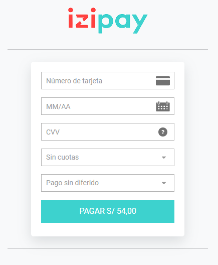
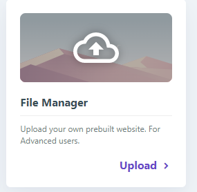
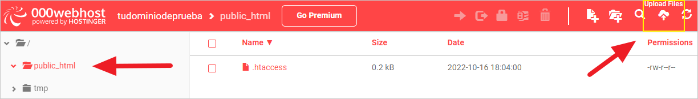
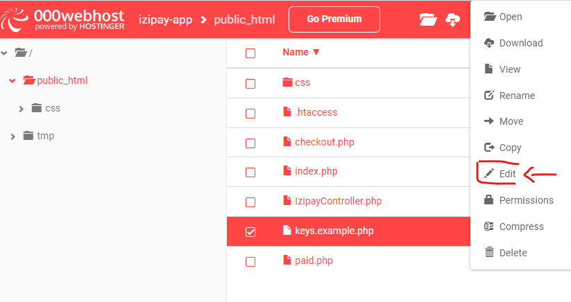

# Embedded-PaymentForm-PHP

<p align="justify">Ejemplo de un formulario Embedido con PHP, este ejemplo te servira como guia para poder ejecutar el formulario de pago de Izipay
dentro de cualquier proyecto que utilice el lenguaje de programacion php.
 
PHP es un lenguaje de programación destinado a desarrollar aplicaciones para la web y crear páginas web, favoreciendo la conexión entre los servidores y la interfaz de usuario.

</p>
<p align="center">
    
</p>

##Este ejemplo es solo una guía para poder realizar la integración de la pasarela de pagos,puede realizar las modificaciones necesarias para su proyecto.


<a name="Requisitos_Previos"></a>

## Requisitos Previos

* Acceso al Back Office Vendedor (BOV) y Claves de autenticación. [Guía Aquí](https://github.com/izipay-pe/obtener-credenciales-de-conexion)
* Servidor Web
* PHP 7.0 o superior

## 1.- Crear el proyecto

Descargar el proyecto .zip haciendo click [Aquí](https://github.com/izipay-pe/Embedded-PaymentForm-Php/archive/refs/heads/main.zip) o clonarlo desde Git.  
```sh
git clone https://github.com/izipay-pe/Embedded-PaymentForm-Php.git
``` 
* **Paso 1:** Mover el proyecto y descomprimirlo en la carpeta htdocs en la ruta de instalación de Xampp: `C:\xampp\htdocs`

  

* **Paso 2:** Abrir la aplicación XAMPP Control Panel ejecutar el botón **Start** del modulo de **Apache**, quedando de la siguiente manera:

  

* **Paso 3:** Abrir el navegador web(Chrome, Mozilla, Safari, etc) con el puerto 80 que abrió xampp : **http://localhost:80/Embedded-PaymentFormT1-Php/** y realizar una compra de prueba.

    

* **Error:** Si intenta pagar, tendrá el siguiente error: **Warning: Undefined array key "formToken" in /ruta_raiz_proyecto/checkout.php on line 18**.
Es porque el **formToken** es inválido, verifique si ha configurado correctamenete sus crendeciales **API REST** o tiene el código de la moneda incorrecto.

## 2.- Subirlo al servidor web
Para este ejemplo se utilizó el servidor gratuito de [000webhost](https://www.000webhost.com), ingrese a su cuenta de [000webhost](https://www.000webhost.com) y siga los siguientes pasos.   

* **Paso 1:** Crearse un nuevo sitio.

    

* **Paso 2:** Crear una URL pública y generar una contraseña de acceso a su sitio.

    

* **Paso 3:** Seleccionar File Manager para subir el proyecto.  

    

* **Paso 4:** Seleccionar la carpeta `public_html` y subir los archivos del proyecto .zip   
    ```sh
    index.php
    Izipayontroller.php
    checkout.php
    paid.php
    key.example.php
    css/style.css
    ```
    

    Ver el resultado en: https://tusitio.000webhostapp.com

* **Paso 5: Configurar datos de conexión**
    Editar el archivo `keys.example.php` en la ruta raiz del proyecto `public_html/`.

    

* **Nota**: Reemplace **[CHANGE_ME]** con sus credenciales de `API REST` extraídas desde el Back Office Vendedor en el archivo `carpta_raiz/keys.example.php` de la ruta raíz del proyecto, ver [Requisitos Previos](#Requisitos_Previos).   

    ```sh
    // Identificador de su tienda
    IzipayController::setDefaultUsername("~ CHANGE_ME_USER_ID ~");

    // Clave de Test o Producción
    IzipayController::setDefaultPassword("~ CHANGE_ME_PASSWORD ~");

    // Clave Pública de Test o Producción
    IzipayController::setDefaultPublicKey("~ CHANGE_ME_PUBLIC_KEY ~");

    // Clave HMAC-SHA-256 de Test o Producción
    IzipayController::setDefaultHmacSha256("~ CHANGE_ME_HMAC_SHA_256 ~");

    // URL del servidor de Izipay
    IzipayController::setDefaultEndpointApiRest("https://api.micuentaweb.pe");
    ``` 

## 3.- Transacción de prueba

El formulario de pago está listo, puede intentar realizar una transacción utilizando una tarjeta de prueba con la barra de herramientas de depuración (en la parte inferior de la página).


Para obtener más información, eche un vistazo a:

* [Formulario incrustado: prueba rápida](https://secure.micuentaweb.pe/doc/es-PE/rest/V4.0/javascript/quick_start_js.html)
* [Primeros pasos: pago simple](https://secure.micuentaweb.pe/doc/es-PE/rest/V4.0/javascript/guide/start.html)
* [Servicios web - referencia de la API REST](https://secure.micuentaweb.pe/doc/es-PE/rest/V4.0/api/reference.html)

**NOTA**

1.- Paso de la tienda al modo PRODUCTION 

     Modifique su implementación para utilizar el incrustado en producción:
     * la contraseña de producción,
     * clave pública de producción,
     * la clave HMAC-SHA-256 de producción para calcular la firma contenida en el campo kr-hash.
     
2.- No tengo una cuenta activa con Izipay. [Suscribete Aquí](https://online.izipay.pe/comprar/cliente)

   | CARACTERÍSTICAS | VALOR |
   | ------------- | ------------- |
   | Usuario de prueba  | 89289758  |
   | Contraseña de prueba  | testpassword_7vAtvN49E8Ad6e6ihMqIOvOHC6QV5YKmIXgxisMm0V7Eq  |
   | Clave pública de prueba  | 89289758:testpublickey_TxzPjl9xKlhM0a6tfSVNilcLTOUZ0ndsTogGTByPUATcE  |
   | Clave HMAC SHA256 de prueba  | fva7JZ2vSY7MhRuOPamu6U5HlpabAoEf8VmFHQupspnXB  |
   | URL de base  | https://api.micuentaweb.pe |
   | URL para el cliente JavaScript | https://static.micuentaweb.pe/static/js/krypton-client/V4.0/stable/kr-payment-form.min.js  |

## 4.- Implementar IPN
IPN son las siglas de Instant Payment Notification (URL de notificación instantánea, en inglés). Al crear una transacción o cambiar su estado, nuestros servidores emitirán una IPN que llamará a una URL de notificación en sus servidores. Esto le permitirá estar informado en tiempo real de los cambios realizados en una transacción.

Las IPN son la única manera de recibir notificaciones en los casos siguientes:

* La conexión a Internet del comprador se ha cortado.
* El comprador cierra su navegador durante el pago.
* Se ha rechazado una transacción.
* El comprador no ha terminado su pago antes de la expiración de su sesión de pago.

Por lo tanto, es obligatorio integrar las IPN.

   <p align="center">
     
   </p>  

* Ver manual de implementacion de la IPN [Aquí](https://secure.micuentaweb.pe/doc/es-PE/rest/V4.0/kb/payment_done.html)

* Ver el ejemplo de la respuesta IPN con PHP [Aquí](https://github.com/izipay-pe/Redirect-PaymentForm-IpnT1-PHP)

* Ver el ejemplo de la respuesta IPN con NODE.JS [Aquí](https://github.com/izipay-pe/Response-PaymentFormT1-Ipn)


